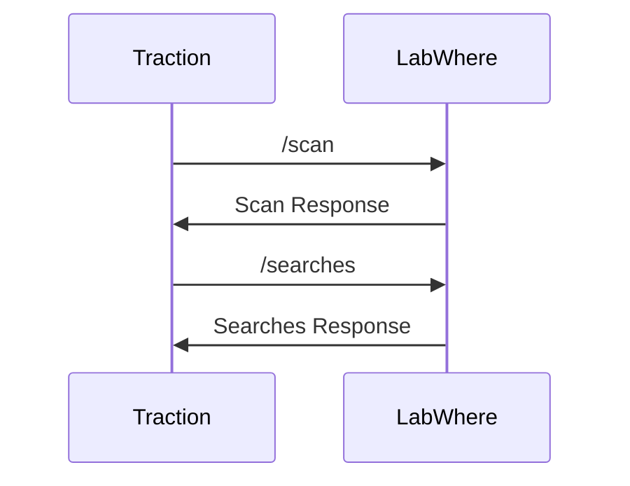
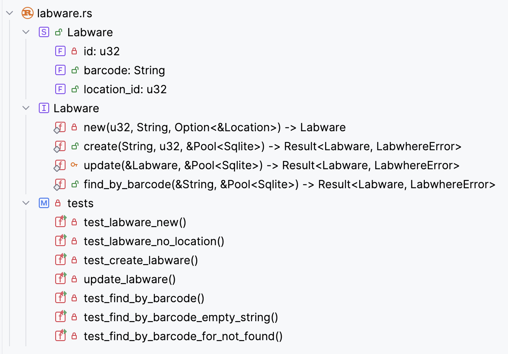
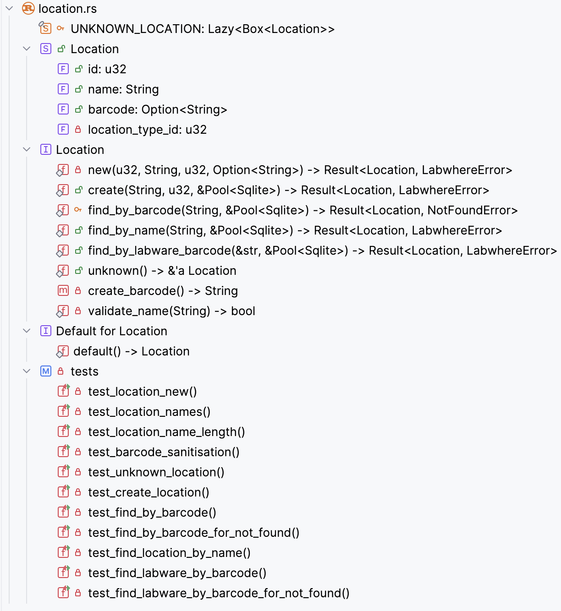
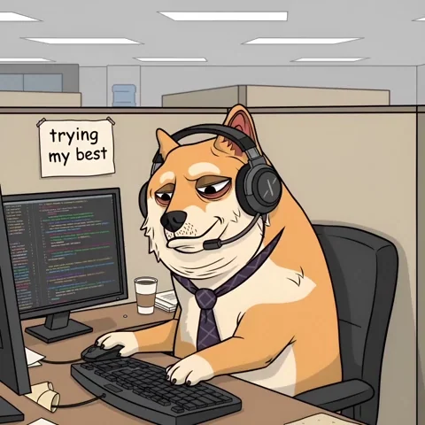

---
# try also 'default' to start simple
theme: apple-basic
# random image from a curated Unsplash collection by Anthony
# like them? see https://unsplash.com/collections/94734566/slidev
# background: https://cover.sli.dev
# some information about your slides (markdown enabled)
title: Our Journey in Rust
info: |
  Our Journey in Rust.
# apply UnoCSS classes to the current slide
# class: text-center
# https://sli.dev/features/drawing
drawings:
  persist: false
# slide transition: https://sli.dev/guide/animations.html#slide-transitions
transition: slide-left
# enable MDC Syntax: https://sli.dev/features/mdc
mdc: true
# duration of the presentation
duration: 30min
layout: intro
---


# Our Journey in Rust

The Challenges, Triumphs, and Takeaways

<div class="absolute bottom-10">
  <span class="font-700">
    Dasun, Adullah and Shiv
  </span>
</div>


<!--
The last comment block of each slide will be treated as slide notes. It will be visible and editable in Presenter Mode along with the slide. [Read more in the docs](https://sli.dev/guide/syntax.html#notes)
-->
---
transition: fade-out
---

 # The start of a wonderful journey..  


<div class="mt-6">

 ## Rust Group Project 

</div>

- Steve & Dasun collaborated for a couple of weeks.
- Abdullah and Shiv joined later in the journey.

<v-click>

## Prototype Project

- Started something closer to our domain.
- Built as a learning prototype (not production).
- Avoided ready-made frameworks.

</v-click>

<v-click>

## Ways of working

- One session (1 - 1.5hours) a week.
- Took turns in running the session.


</v-click>

<!-- - 📝 **Text-based** - focus on the content with Markdown, and then style them later -->
<!-- - 🎨 **Themable** - themes can be shared and re-used as npm packages -->
<!-- - 🧑‍💻 **Developer Friendly** - code highlighting, live coding with autocompletion -->
<!-- - 🤹 **Interactive** - embed Vue components to enhance your expressions -->
<!-- - 🎥 **Recording** - built-in recording and camera view -->
<!-- - 📤 **Portable** - export to PDF, PPTX, PNGs, or even a hostable SPA -->
<!-- - 🛠 **Hackable** - virtually anything that's possible on a webpage is possible in Slidev -->
<!-- <br> -->
<!-- <br> -->


<style>
h1 {
  background-color: #2B90B6;
  background-image: linear-gradient(45deg, #4EC5D4 10%, #146b8c 20%);
  background-size: 100%;
  -webkit-background-clip: text;
  -moz-background-clip: text;
  -webkit-text-fill-color: transparent;
  -moz-text-fill-color: transparent;
}
</style>

<!--

The decision on investing some time to learn Rust was unique for each of us. Steve and I decided to learn Rust’s low-level constructs as much as we can and potentially investigate any use cases for it within the institute. We had some involvement on an on-going project, and decided to start developing a prototype which is much closer to what we do in PSD. Abdullah - who wanted to try out learning a new language in a hands-on approach - and Shiv - who wanted to collaboratively explore and learn Rust joined later on in developing the prototype.

As I mentioned earlier, the prototype is something that we felt was very close to our domain. It is, in fact, a re-write - Rust community calls this an “oxidisation” - of an application called LabWhere that gives an interface to scan in the location of a particular labware and an interface to track locations for each labware - for example plates and tubes. 

For the prototype, we chose two use cases:

Scan-in a piece of labware into a pre-defined location.
Search the labware and assert that the labware was scanned into the correct location.

The prototype is a backend artefact. We have integrated the prototype with our long-read LIMS frontend Traction to demonstrate the workings of the prototype. The connection to the long-read LIMS is behind a feature flag and flipping the feature flag would direct the traffic to the actual service or to the prototype.

We used as few abstractions as possible to build the prototype. This is because our intention was to learn the syntax and the semantics of the Rust language; not to learn a framework like Axum or Rocket. 

We need to emphasise the fact that this is in fact a prototype. This was not meant for production.

One of the key points we want to highlight in this presentation is that we successfully learned a new language—its syntax and semantics—and used it to re-write a small part of an existing system and integrate it with our current infrastructure. We accomplished this by collaborating among ourselves for just about one to one and a half hours per week, and it’s been a process we’ve genuinely enjoyed.

So, to the next section of our presentation: Shiv will now demonstrate the working of the rust prototype we’ve built.

Over to you, Shiv.

-->

---
transition: slide-up
level: 2
---

# Demonstration

<div class="border-l-4 border-blue-400/80 bg-blue-900/20 p-4  rounded-lg">
  💡<strong class="text-blue-800">Note:</strong></img> is an <b>application</b>. <code>Labware</code> 🧪 🧫 stands for a <b>container</b> (e.g., plates, tubes, etc.)</div>

Denoted here is how Traction  interacts with LabWhere.

<br>

<div class="flex items-center justify-center">



</div>

---
transition: slide-up
level: 2
---

# Implementation Details 

Some tools we've used.

- **Tokio** 
  - Rust’s asynchronous runtime that needs to be plugged in.
  - Required to use `async` and `await` grammar.

- **Hyper** 
  - Abstracts some parts of network programming.
  - Easy access to HTTP request-response cycle.

- **SQLx** 
  - As the SQLite Driver.

---
transition: slide-up
layout: two-cols
layoutClass: gap-16
class: text-xl
---

# Overall architecture

Controller, models and services.

<br>


- A **controller** forwards incoming requests to the corresponding service.
- A **service** contains business logic.
- A **data model** is the interface between the database.

::right::


<div class="flex items-center justify-center h-full dark:invert">
  </img>
</div>


<style>
ul li {
  margin-bottom: 1.5rem;
}
</style>

---
transition: slide-up
level: 2
---

# Controllers


We check the HTTP method (courtesy of Hyper), and the URI to forward request to the service.

```rs {*|7-9|10-12|13-18|*}{lines:true}
async fn route(
     req: Request<impl Body<Data = Bytes, Error = hyper::Error> + Send + Sync + 'static>,
     connection: &Pool<Sqlite>,
 ) -> Result<Response<BoxBody<Bytes, hyper::Error>>, hyper::Error> {
     match (req.method(), req.uri().path()) {
         (&Method::OPTIONS, _) => Ok(preflight().await),
         (&Method::POST, "/scan") => {
             Ok(scan(connection, &get_request_string(req).await?).await?)
         }
         (&Method::POST, "/searches") => {
             Ok(search(connection, get_request_string(req).await?).await?)
         }
         _ => {
             let mut not_found = Response::new(empty());
             *not_found.status_mut() = StatusCode::NOT_FOUND;
             error!("Responding with not found");
             Ok(not_found)
         }
     }
 }
```

---
transition: slide-up
---

# Services

```rust
pub(crate) async fn search(
    connection: &Pool<Sqlite>,
    request_string: String,
) -> Result<Response<BoxBody<Bytes, hyper::Error>>, hyper::Error> { ... }

#[cfg(test)]
mod tests {
    #[tokio::test]
    async fn test_search() {...}
}
```

```rust
pub async fn scan(
    connection: &Pool<Sqlite>,
    request: &str,
) -> std::result::Result<Response<BoxBody<Bytes, hyper::Error>>, hyper::Error> { ... }

#[cfg(test)]
mod tests {
    #[tokio::test]
    async fn test_scan() { ... }

    #[tokio::test]
    async fn test_scan_without_correct_content_type() { ... }
}
```

---
transition: fade-out
---

# Models

<div class="grid md:grid-cols-2 gap-4">
    <div>
        
    </div>
    <div>
        
    </div>
</div>

---
transition: fade-out
---

# Code


Let's dive into the code. 

Pardon the dog gifs 🐶

<div class="flex items-center justify-center">
<div class="grid grid-cols-2 md:grid-cols-3 gap-4">
    <div>
        
    </div>
    <div>
        
    </div>
    <div>
        
    </div>
</div>
</div>

---
transition: fade-out
class: text-2xl
---


# Oxidation Compiler 


- Extended our Rust learning
- Contributing to the Oxc project
- Rule architecture and pattern matching in Rust
- Applying our rust concepts to larger projects
- Rust in the real world
- Plan to keep contributing 


---
transition: fade-out
class: text-md
---

# Summary on Rust.

<table>
  <thead>
    <tr>
      <th></th>
      <th v-click="1"><strong>Things we liked</strong></th>
      <th v-click="2"><strong>Things we liked, but found difficult to grasp</strong></th>
      <th v-click="3"><strong>Things we didn't/don't like</strong></th>
    </tr>
  </thead>
  <tbody>
    <tr>
      <td>1</td>
      <td v-click="1">Pattern matching <code>match</code> statements).</td>
      <td v-click="2">Borrow checker.</td>
      <td v-click="3">Verbosity at times <code>?</code> call, <code>Result</code>, and <code>Option</code> <em>can</em> be a bit verbose).</td>
    </tr>
    <tr>
      <td>2</td>
      <td v-click="1">Functional-style enums <code>Option</code> and <code>Result</code>).</td>
      <td v-click="2">Lifetimes.</td>
      <td v-click="3">Slow builds.</td>
    </tr>
    <tr>
      <td>3</td>
      <td v-click="1"><code>Cargo</code> as a package manager.</td>
      <td v-click="2">Boxed values (heap-allocated objects) i.e., <code>Box</code>, <code>Arc</code>, etc.</td>
      <td v-click="3"><code>"the method . . . exists but the following trait bounds were not satisfied"</code></td>
    </tr>
    <tr>
      <td>4</td>
      <td v-click="1">Support for tests with <code>#cfg[(test)]</code></td>
      <td v-click="2"></td>
      <td v-click="3"></td>
    </tr>
  </tbody>
</table>

---
transition: fade-out
class: text-xl
---

# Useful Links

- [Rust](https://rust-lang.org/)
- [OXC](https://oxc.rs/)
- [Tokio](https://tokio.rs/)
- [Hyper](https://hyper.rs/)
- [SQLx](https://github.com/launchbadge/sqlx)

Link to our code: [Rust-Wellcome/labwhere](https://github.com/Rust-Wellcome/labwhere)

Link to our slides: [rust-wellcome.github.io/labwhere](https://rust-wellcome.github.io/labwhere)


---
transition: fade-out
layout: end
---

# Thank You!

You've head about Rust, and now you have seen it too!
✅ ✅


