---
# try also 'default' to start simple
theme: apple-basic
# random image from a curated Unsplash collection by Anthony
# like them? see https://unsplash.com/collections/94734566/slidev
# background: https://cover.sli.dev
# some information about your slides (markdown enabled)
title: Our Journey in Rust
titleTemplate: '%s'
favicon: study.png
aspectRatio: 16/9
lineNumbers: true
info: |
  Our Journey in Rust.
# apply UnoCSS classes to the current slide
# class: text-center
# https://sli.dev/features/drawing
drawings:
  persist: false
# slide transition: https://sli.dev/guide/animations.html#slide-transitions
transition: slide-left
# enable MDC Syntax: https://sli.dev/features/mdc
mdc: true
# duration of the presentation
duration: 30min
layout: intro
---


# Our Journey in Rust 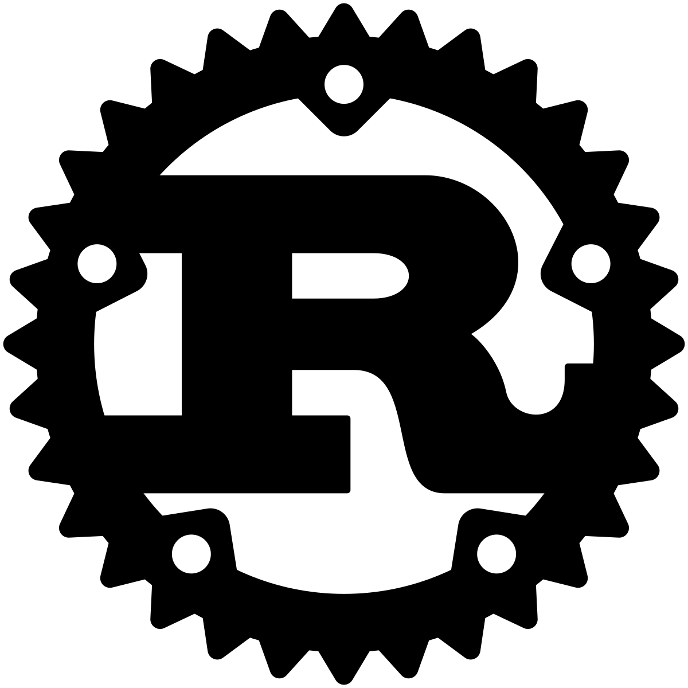

The Challenges, Triumphs, and Takeaways

<div class="absolute bottom-10">
  <span class="font-700">
  Dasun 👾 <span v-mark.circle.orange="2">{<code style="color: grey">dp27</code>}</span><sup>‡</sup>, Abdullah 🚀 <span v-mark.circle.blue="2">{<code style="color: grey">ay6</code>}</span><sup>‡</sup>, and Shiv💡<span v-mark.circle.brown="2">{<code style="color: grey">sb78</code>}</span><sup>‡</sup> 
  </span>
  <br>
  <span v-mark.box.red="1"><small>Production Software Development (PSD)</small></span>
  <br>
  <small style="font-size: 0.55em;">
  <sup>‡</sup>Senior Software Developer
  </small>
</div>
<div class="absolute bottom-10 right-10 flex flex-col items-center">
  
  <span class="mb-2 text-xs text-gray-600">Scan to view slides</span>
</div>

<footer class="absolute bottom-2 left-0 w-full text-center text-xs text-gray-500" style="font-size: 0.4rem">
  Logos © their respective owners. Rust logo © The Rust Foundation.
</footer>

<!-- 

Hello, good afternoon everyone! I am Dasun, and I've got Abdullah presenting alongside with me. We are from PSD - which stands for Production Software Development ➡️ ➡️ ➡️. Tom spoke about what we do it PSD, and at PSD our tech stack is quite polyglot by nature so it's quite natural for us to gravitate towards checking out what other programming languages are all about. 

This presentation is about our journey in learning a programming language which was new for us. We want to share our triumphs, the challenges we faced, and leave you with some key takeaways.

And we will kindly have to ask to hold off to your questions until the end. If the time does not permit it, please feel free to contact us via Slack or Email (our user IDs are there ➡️ ➡️ ➡️ in the slide along with our names).
 -->


---
transition: fade-out
layout: two-cols-header
---

 # The start of a wonderful journey..  

::left::

<div class="mt-6">

 ## Rust Group Project

</div>

- Steve & Dasun collaborated for a couple of weeks.
- Abdullah and Shiv joined later in the journey.

<!-- <div v-if="$slidev.nav.clicks === 1" style="
  position: fixed;
  top: 0;
  left: 0;
  width: 100%;
  color: white;
  z-index: 9999;
  text-align: center;
  padding: 1rem;
">
  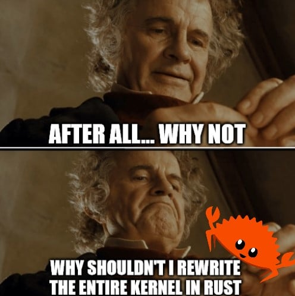
</div> -->

<div v-if="$slidev.nav.clicks === 1" class="absolute top-10 left-10 z-50 flex gap-8">

  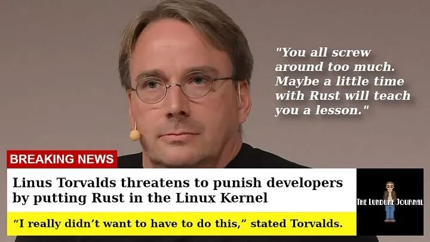
</div>

<v-click at="+3">

<h2>
Prototype Project <span v-mark.circle.purple="4">("LabWhere")</span>
</h2>

- Started something closer to our domain.
- Built as a learning <span v-mark.highlight.yellow="5"> prototype (not production) </span>.
- Avoided ready-made frameworks.

</v-click>

<v-click at="+3">

## Ways of working

- One session (1 - 1½ hours) a week.
- Each person took charge in implementation.

</v-click>


::right::

<div class="flex items-center justify-center h-full">
  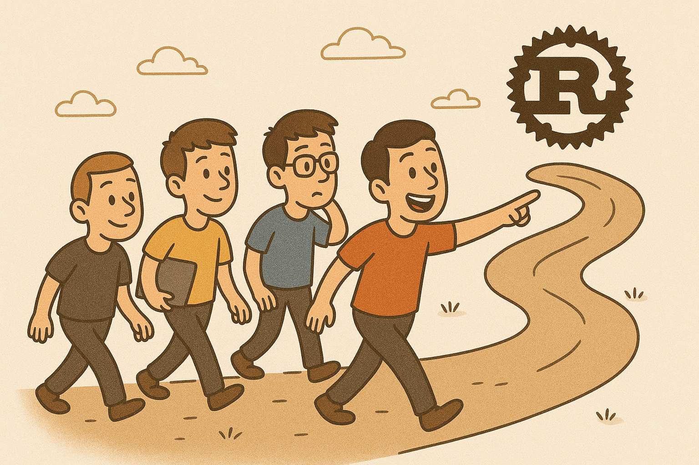
</div>

<footer class="absolute bottom-2 left-0 w-full text-center text-xs text-gray-500" style="font-size: 0.4rem">
  Logos © their respective owners. Rust logo © The Rust Foundation.
</footer>


<style>
h1 {
  background-color: #2B90B6;
  background-image: linear-gradient(45deg, #4EC5D4 10%, #146b8c 20%);
  background-size: 100%;
  -webkit-background-clip: text;
  -moz-background-clip: text;
  -webkit-text-fill-color: transparent;
  -moz-text-fill-color: transparent;
}
</style>

<!--

So, Rust was this shiny programming language that made people look at their own code and thought of integrating Rust into it. (It happened with the Linux kernel ➡️ ➡️ ➡️, and it happened with Git's `reftable` which is coming out in Git 3.0). Naturally, we wanted to check what it's all about ➡️ ➡️ ➡️. We knew none of our PSD applications actually needed a rewrite — they were doing just fine. But we figured learning Rust would be a great "excuse" to explore how programming could be made “safer”, especially when it comes to those "sneaky memory leaks" that you read on blog posts every couple of weeks.

We've got Steve in our audience - he's my line manager. So we both decided to learn what Rust is all about. We decided that the best way to learn a new language was to actually write something with it. We then decided to start developing a **prototype** which was much closer to what we do in PSD. And then we found kindred spirits in Abdullah and Shiv — both equally excited to dive into Rust with a hands-on, collaborative approach.

➡️ ➡️ ➡️ 

As I mentioned earlier, the prototype aligns closely with our domain. It’s essentially a reimagining of an existing application called LabWhere ➡️ ➡️ ➡️, which provides an interface for scanning and tracking the locations of plates and tubes.

For the prototype, we focused on two specific use cases:

1. Scan-in a plate or a tube into a pre-defined location.
2. Search the plate or tube and assert that the they were scanned into the correct location.

The prototype is a backend component that we’ve integrated with our long-read LIMS frontend, Traction, to showcase its functionality. The connection to the long-read LIMS is controlled via a feature flag — flipping the flag redirects traffic between the original LabWhere service and the prototype.

We intentionally kept the prototype as simple and minimal as possible, using **few out-of-the-box web frameworks**. Our goal was to understand the syntax and semantics of Rust itself — not to dive into web frameworks like Axum or Rocket.

We need to emphasise the fact that this is in fact a prototype. ➡️ ➡️ ➡️ This was not meant for production.

➡️ ➡️ ➡️ 

One of the key takeaways we want to highlight in this presentation is that we successfully learned a new programming language and used it to write a small part of an existing system, fully integrated with our current infrastructure. We achieved this through collaborative sessions of just about one to one and a half hours per week — and it’s been a process we’ve genuinely enjoyed.

So, to the next section of our presentation: Shiv will now demonstrate the working of the rust prototype we’ve built.

Over to you, Shiv.

-->

---
transition: slide-up
level: 2
---

# Demonstration

<div class="border-l-4 border-blue-400/80 bg-blue-900/20 p-4  rounded-lg">
  💡<strong class="text-blue-800">Note:</strong>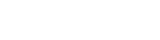</img> is an <b>application</b>. <code>Labware</code> 🧪 🧫 stands for a <b>container</b> (e.g., plates, tubes, etc.)</div>

Denoted here is how Traction 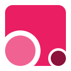 interacts with LabWhere.

<br>

<div class="flex items-center justify-center">

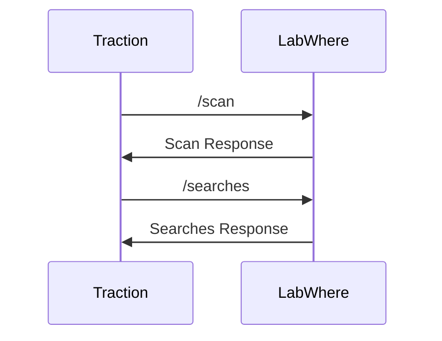

</div>

<!-- 

So, as I said before, we've hooked the prototype to our long-read front-end called Traction, through a feature flag. Traction communicates with the prototype to scan plates (or tubes) in, and searches for them. That is the interaction visualised by the sequence diagram there. This is going to be a quick demo but know that the labwhere prototype is the one that's serving up scanning and searching requests.

-->

---
transition: slide-up
level: 2
---

<div class="flex items-center justify-center">
  <div style="width: 100%; max-width: 890px; aspect-ratio: 16/9; display: flex; justify-content: center; align-items: center;">
    <div style="width: 100%; height: 100%; border-radius: 14px; box-shadow: 0 4px 32px #000a; border: 1.5px solid #bbb; background: #f8f9fa; display: flex; flex-direction: column; overflow: hidden;">
      <!-- Browser Title Bar -->
      <div style="height: 26px; background: linear-gradient(90deg, #e3e4e8 80%, #d1d5db 100%); border-bottom: 1px solid #e5e7eb; display: flex; align-items: center; padding: 0 1.2em;">
        <div style="display: flex; gap: 0.5em; align-items: center; margin-right: 1em;">
          <span style="width: 12px; height: 12px; background: #ff5f56; border-radius: 50%; display: inline-block; border: 1px solid #e55347;"></span>
          <span style="width: 12px; height: 12px; background: #ffbd2e; border-radius: 50%; display: inline-block; border: 1px solid #e1a116;"></span>
          <span style="width: 12px; height: 12px; background: #27c93f; border-radius: 50%; display: inline-block; border: 1px solid #1aab29;"></span>
        </div>
        <div style="flex: 1; text-align: center; color: #444; font-size: 0.65em; font-weight: 500; letter-spacing: 0.01em; user-select: none; font-family: -apple-system, BlinkMacSystemFont, 'Segoe UI', Roboto, Helvetica, Arial, sans-serif;">
                  Rust LabWhere Demo: Traction UI
                </div>
      </div>
      <!-- Chrome Address Bar -->
      <div style="height: 32px; background: #f5f6fa; border-bottom: 1px solid #e5e7eb; display: flex; align-items: center; padding: 0 1.2em; box-shadow: 0 3px 12px -4px #0002; z-index: 2;">
        <div style="flex: 1; display: flex; align-items: center; justify-content: center;">
          <div style="display: flex; align-items: center; width: 100%; max-width: 520px; font-size: 0.85em; padding: 0.12em 0.2em;">
            <span style="margin-right: 0.4em; color: #bdbdbd; font-size: 1em;">
              <svg width="16" height="16" viewBox="0 0 24 24" fill="none" stroke="#bdbdbd" stroke-width="2" stroke-linecap="round" stroke-linejoin="round"><circle cx="11" cy="11" r="8"/><line x1="21" y1="21" x2="16.65" y2="16.65"/></svg>
            </span>
            <div style="flex: 1; background: #fff; border: 1.5px solid #d1d5db; border-radius: 999px; padding: 0.13em 0.8em; font-size: 0.97em; color: #444; box-shadow: 0 1px 2px #0001; display: flex; align-items: center; min-width: 0;">
              <span style="color: #bdbdbd; font-size: 0.85em; margin-right: 0.4em;">🔒</span>
              <span style="white-space: nowrap; overflow: hidden; text-overflow: ellipsis; font-size: 0.85em; font-family: -apple-system, BlinkMacSystemFont, 'Segoe UI', Roboto, Helvetica, Arial, sans-serif; color: #7a7373ff;">https://uat.traction.psd.sanger.ac.uk</span>
            </div>
            <span style="margin-left: 0.4em; color: #bdbdbd; font-size: 1em;">
              <svg width="16" height="16" viewBox="0 0 24 24" fill="none" stroke="#bdbdbd" stroke-width="2" stroke-linecap="round" stroke-linejoin="round"><circle cx="12" cy="12" r="1"/><circle cx="19" cy="12" r="1"/><circle cx="5" cy="12" r="1"/></svg>
            </span>
          </div>
        </div>
      </div>
      <!-- Browser Content (iframe) -->
      <div style="flex: 1; background: #fff; display: flex; align-items: stretch;">
        <iframe
          src="https://uat.traction.psd.sanger.ac.uk/#/dashboard"
          style="width: 100%; height: 100%; border: none; background: white; min-height: 320px;"
          allowfullscreen
          loading="lazy"
          title="Traction Dashboard Demo"
        ></iframe>
      </div>
    </div>
  </div>
</div>

<div style="width: 100%; text-align: center; margin-top: 0.2em; font-size: 0.55em; color: #888; letter-spacing: 0.01em;">
  <span style="font-size: 0.6em;">This "window" is an embedded iframe rendering the live Traction UAT website (URL shown in the "address bar") for demonstration purposes.</span>
</div>


---
transition: slide-left
level: 2
---

# Implementation Details 

Some tools we've used.

- **Tokio** 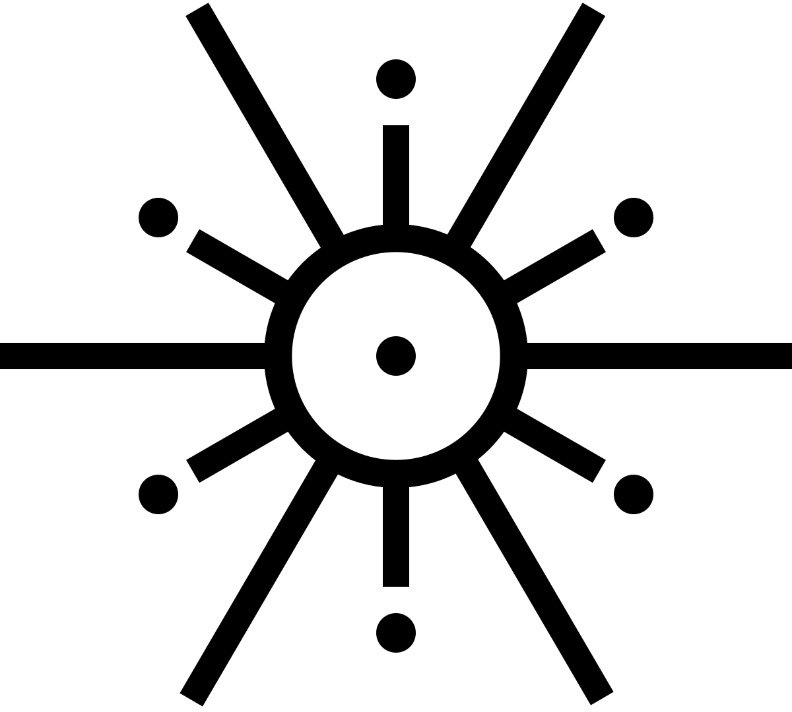
  - Rust’s asynchronous runtime that needs to be plugged in.
  - Required to use `async` and `await` grammar.

- **Hyper** 
  - Abstracts some parts of network programming.
  - Easy access to HTTP request-response cycle.

- **SQLx** 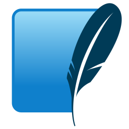
  - As the SQLite Driver.

<footer class="absolute bottom-2 left-0 w-full text-center text-xs text-gray-500" style="font-size: 0.4rem">
  Logos © their respective owners.
</footer>

<!-- 

When we started this project, our goal was to really learn Rust itself — not just to pick up a framework, as mentioned before. That’s why we deliberately avoided using an out-of-the-box web framework. Frameworks can be very powerful, but they often hide a lot of the underlying language details. We wanted to experience those details directly, even if it meant doing a little more work ourselves.

At the same time, we didn’t want to be bogged down by unnecessary complexity. So, we made use of a few essential building blocks from the ecosystem — specifically Tokio, Hyper, and Sqlx — to cover the basics of async runtime, networking, and database access.

It’s also worth pointing out that we didn’t focus on security aspects in this project. Things like access control headers or same-origin policies weren’t part of our scope, because the aim was strictly to learn the language fundamentals rather than build a production-ready service.
First, we used Tokio, which is Rust’s asynchronous runtime. Rust itself provides the grammar for asynchronous I/O ((async, await, Future), but it doesn’t ship with a runtime (event loop, task scheduler, timers, and I/O drivers). That’s something you need to plug in separately as a crate, and Tokio is the most widely used choice for this.
Next, we brought in Hyper, which is a third-party HTTP library. Hyper abstracts away a lot of the lower-level network programming details and makes it easier for us to work directly with the HTTP request–response cycle, without having to reinvent all the protocol handling ourselves.
And finally, we used Sqlx as the SQLite driver. That gave us a straightforward way to interact with the database from Rust.

So, to summarise: Tokio runs the asynchronous I/O, Hyper gives us a clean abstraction for HTTP traffic, and Sqlx provides the database driver support.

-->

---
transition: slide-right
layout: two-cols
layoutClass: gap-16
class: text-xl
---

# Overall architecture

Controller, models and services.

<br>


- A **controller** forwards incoming requests to the corresponding service.
- A **service** contains business logic.
- A **data model** is the interface between the database.

::right::


<div class="flex items-center justify-center h-full dark:invert">
  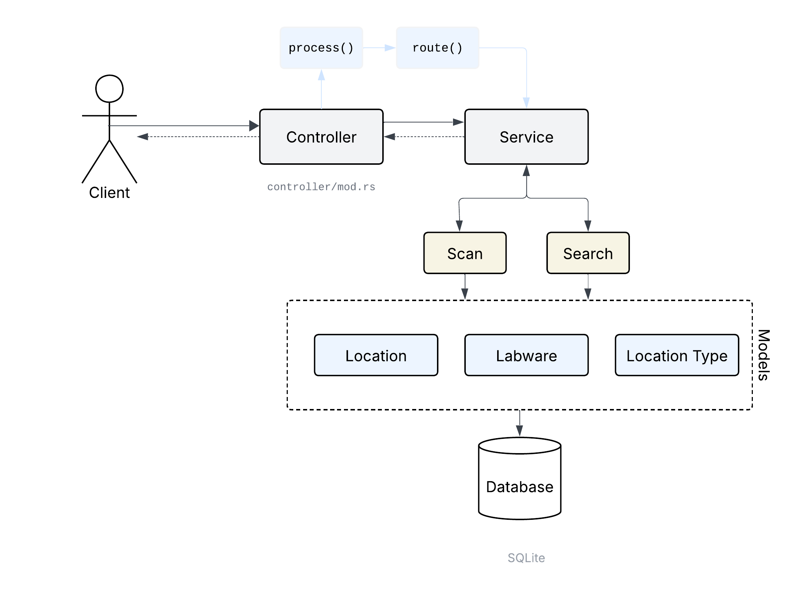</img>
</div>


<style>
ul li {
  margin-bottom: 1.5rem;
}
</style>

---
transition: slide-left
---

# Code

````md magic-move {lines: true}
```rs {*|8}{lines:true}
async fn route(
     req: Request<impl Body<Data = Bytes, Error = hyper::Error> + Send + Sync + 'static>,
     connection: &Pool<Sqlite>,
 ) -> Result<Response<BoxBody<Bytes, hyper::Error>>, hyper::Error> {
     match (req.method(), req.uri().path()) {
         (&Method::OPTIONS, _) => Ok(preflight().await),
         (&Method::POST, "/scan") => {
             Ok(scan(connection, &get_request_string(req).await?).await?)
         }
         (&Method::POST, "/searches") => {
             Ok(search(connection, get_request_string(req).await?).await?)
         }
         _ => {
             let mut not_found = Response::new(empty());
             *not_found.status_mut() = StatusCode::NOT_FOUND;
             error!("Responding with not found");
             Ok(not_found)
         }
     }
 }
```
```rs {*|8}{lines:true}
pub async fn scan(
    connection: &Pool<Sqlite>,
    request: &str,
) -> std::result::Result<Response<BoxBody<Bytes, hyper::Error>>, hyper::Error> {
  
    // ... serialisation logic here.
  
    match Scan::create(json, connection).await {
        Ok(scan) => {
            // Logic for preparing the success response here.
        }
        Err(err) => {
            // Logic for preparing error response here.
        }
    }
}
```
```rs {*|3,8,12|12}{lines:true}
pub async fn create(scan: Scan, connection: &Pool<Sqlite>) -> Result<Scan, LabwhereError> {
    let location: Location =
        match Location::find_by_barcode(scan.location_barcode, connection).await {
          // ... response handling ...
        };
    // ... some validations ...
    for barcode in split_barcodes.iter() {
        match Labware::find_by_barcode(&barcode.to_string(), connection).await {
            Ok(mut labware) => {
                labware.location_id = location.id;

                match Labware::update(&labware, connection).await {
                  // .. return proper value or handle errors ...
                }
            }
            Err(error) => match error {
                // ... error handling
            },
        };
    }
    // ... return the correct value ...
}
```
```rs {*|6-13|6-13}{lines:true}
pub(crate) async fn update(
    labware: &Labware,
    connection: &Pool<Sqlite>,
) -> Result<Labware, LabwhereError> {
    // ⚠️⚠️ This is NOT our code. This is only here just to show you something ⚠️⚠️
    let labware_query_result: Result<SqliteQueryResult, _> =
        sqlx::query("UPDATE labwares SET location_id = ? WHERE id = ?")
            .bind(labware.location_id)
            .bind(labware.id)
            .execute(connection)
            .await;
    // Panics if labware_query_result is an error value.
    let labware_result_set = labware_query_result.unwrap();

    if labware_result_set.rows_affected() > 0 {
        // ... use sqlx to fetch the labware here...
        return Ok(Labware::new(
            labware.id,
            labware.barcode.clone(),
            Some(&location_result_set),
        ));
    }
    Err(LabwhereError::database_error())
}
```
```rs {*|5-9,10,11,19,20,21|*}{lines:true}
pub(crate) async fn update(
    labware: &Labware,
    connection: &Pool<Sqlite>,
) -> Result<Labware, LabwhereError> {
    match sqlx::query("UPDATE labwares SET location_id = ? WHERE id = ?")
        .bind(labware.location_id)
        .bind(labware.id)
        .execute(connection)
        .await
    {
        Ok(_) => {
            match sqlx::query_as::<_, Location>("SELECT * FROM locations WHERE id = ?")
                .bind(labware.location_id)
                .fetch_one(connection)
                .await
            {
                // ... handle result ...
            }
        }
        Err(_) => Err(LabwhereError::database_error()),
    }
}
```
````
<div v-if="$slidev.nav.clicks === 9" class="absolute top-10 left-1/2 -translate-x-1/2 z-[9999] border-4 border-red-600 rounded-lg animate-border-pulse">
  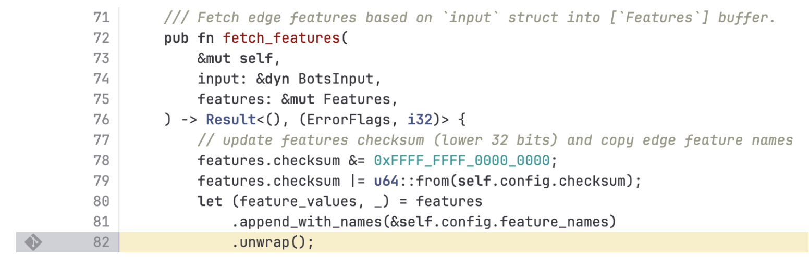
  <div
    class="w-full text-center text-sm text-red-600 font-semibold mt-2"
    style="background-color: #9c0303; color: #ffee00"
  >
    <br>
    🚨🚨 <b>Reason for CloudFlare outage</b>
    <span style="font-size: 0.7em;">
      (Source: CloudFlare
      <a
        href="https://blog.cloudflare.com/18-november-2025-outage/"
        target="_blank"
        rel="noopener noreferrer"
        style="color: #ffee00; text-decoration: underline;"
      >Blog</a>)
    </span>
    🚨🚨
    <br>
    <br>
    Do not call
    <code style="background-color: black; font-size: 0.8em;">unwrap()</code>
    on error values. Use
    <code style="background-color: black; font-size: 0.8em;">match</code>,
    <code style="background-color: black; font-size: 0.8em;">unwrap_err()</code>
    or
    <code style="background-color: black; font-size: 0.8em;">unwrap_or_default()</code>
    instead.
    <br><br>
  </div>
</div>

<style>
@keyframes border-pulse {
  0% {
    box-shadow: 0 0 0 0 rgba(220,38,38,0.7);
    border-color: #dc2626;
  }
  50% {
    box-shadow: 0 0 16px 4px rgba(220,38,38,0.9);
    border-color: #ffee00;
  }
  100% {
    box-shadow: 0 0 0 0 rgba(220,38,38,0.7);
    border-color: #dc2626;
  }
}
.animate-border-pulse {
  animation: border-pulse 1.2s infinite;
  transition: border-color 0.2s;
}
</style>

---
transition: slide-right
class: text-2xl
---


# Future Work: "The Oxidation Compiler" 

- Collection of high-performance tools for JavaScript written in Rust.
- We are writing one of the `ESLint` rules in Rust.
- 1 - 1½ hours per week.
- Applying our Rust concepts to bigger projects and keep contributing.

<footer class="absolute bottom-2 left-0 w-full text-center text-xs text-gray-500" style="font-size: 0.4rem">
  Logos © their respective owners.
</footer>

<!-- 
Lately, as a team, we've been taking our Rust learning a step further, moving from just practicing concepts to actually applying them in a real open-source project.

We've been contributing to the Oxidation Compiler, which is basically a collection of existing Javascript and Typescript tools but rewritten in rust for performance. We looked through the list of tools and found an ESLint rewrite, so we got stuck in and started to try and contribute.

Our focus has been on understanding how the rule architecture works under the hood and how pattern matching is used to build linting rules. This gave us a really good look at how Rust concepts like ownership, pattern matching, and traits come together in a bigger, production-level codebase.

What's been great is that we've not only strengthened our Rust skills, but also learned how large open-source projects are structured, things like contributing guidelines, testing setups, and how maintainers keep everything organised and consistent.
-->

---
transition: slide-up
class: text-md
---

# Summary on Rust.

<table>
  <thead>
    <tr>
      <th></th>
      <th v-click="1"><strong>Things we liked 😊</strong></th>
      <th v-click="2"><strong>Things we liked, but found difficult to grasp 🤔</strong></th>
      <th v-click="3"><strong>Things we didn't/don't like 😞</strong></th>
    </tr>
  </thead>
  <tbody>
    <tr>
      <td>1</td>
      <td v-click="1">Pattern matching <code>match</code> statements).</td>
      <td v-click="2">Borrow checker.</td>
      <td v-click="3">Verbosity at times (<code>unwrap()</code> call, <code>Result</code>, and <code>Option</code> <em>can</em> be a bit verbose).</td>
    </tr>
    <tr>
      <td>2</td>
      <td v-click="1">Functional-style enums <code>Option</code> and <code>Result</code>).</td>
      <td v-click="2">Lifetimes.</td>
      <td v-click="3">Slow builds.</td>
    </tr>
    <tr>
      <td>3</td>
      <td v-click="1"><code>Cargo</code> as a package manager.</td>
      <td v-click="2">Boxed values (heap-allocated objects) i.e., <code>Box</code>, <code>Arc</code>, etc.</td>
      <td v-click="3"><code>"the method . . . exists but the following trait bounds were not satisfied"</code></td>
    </tr>
  </tbody>
</table>

---
transition: fade-out
layout: two-cols
class: text-xl
---

# Useful Links

- [Rust](https://rust-lang.org/)
- [OXC](https://oxc.rs/)
- [Tokio](https://tokio.rs/)
- [Hyper](https://hyper.rs/)
- [SQLx](https://github.com/launchbadge/sqlx)

Link to our code: [Rust-Wellcome/labwhere](https://github.com/Rust-Wellcome/labwhere)

Link to our slides: [rust-wellcome.github.io/labwhere](https://rust-wellcome.github.io/labwhere)

::right::

<div class="flex items-center justify-center h-full mb-2">
  <Youtube width=500 height=280 id="TGfQu0bQTKc"/>
</div>

<div class="flex items-center justify-center -mt-25">
  <div style="font-size: 0.7rem; color: grey"><i>"I let my threads panic ... for pleasure." - Sr. Rust Dev.</i></div>
</div>

<div class="absolute bottom-1 left-10 flex flex-col items-center">
  
  <span class="mb-2 text-xs text-gray-600">Scan to view slides</span>
</div>


---
transition: fade-out
layout: intro
---

# Thank You!

 Rust may have sparked the journey, but the heart of the journey was <u>learning together</u>.

<v-click>

## Key Takeaways

<br>

- Because our <v-mark v-mark.highlight.yellow="2"> <b>collaborative learning</b></v-mark> sessions were highly effective, we plan to carry that approach forward into our PSD work.
- <v-mark v-mark.highlight.yellow="3"> <b>Consistent, small weekly efforts</b> </v-mark> added up and brought us to this point.
- <v-mark v-mark.highlight.yellow="4"> <b>Minimal use of out-of-the-box frameworks</b> </v-mark> helped us better appreciate Rust’s core philosophy.
- <v-mark v-mark.highlight.yellow="5"> <b>Learning together kept our motivation high</b> </v-mark>, and we’ve since kept the momentum going through open-source projects.

</v-click>

<v-click at="+5">
<div class="mascot-thankyou-container">
  
  <span class="mascot-thankyou-text">Ferris the Crab says Thank You!</span>
  <span class="mascot-subtext">(Ferris is Rust's mascot. Read about him <a href="https://rustfoundation.org/media/celebrating-rusts-birthday-with-karen-tolva-creator-of-ferris-the-rustacean/">here</a>).</span>
</div>
</v-click>

<v-click at="7">
  <div class="absolute bottom-1 left-10 flex flex-col items-center">
    
    <span class="mb-2 text-xs text-gray-600">Scan to view slides</span>
  </div>
</v-click>

<style>
@keyframes mascot-dance {
  0% { transform: rotate(-10deg) scale(1) }
  10% { transform: rotate(10deg) scale(1.05) }
  20% { transform: rotate(-8deg) scale(1.08) }
  30% { transform: rotate(8deg) scale(1.1) }
  40% { transform: rotate(-6deg) scale(1.05) }
  50% { transform: rotate(6deg) scale(1) }
  60% { transform: rotate(-8deg) scale(1.08) }
  70% { transform: rotate(8deg) scale(1.1) }
  80% { transform: rotate(-10deg) scale(1.05) }
  90% { transform: rotate(10deg) scale(1) }
  100% { transform: rotate(-10deg) scale(1) }
}
.mascot-thankyou-container {
  position: fixed;
  bottom: 0;
  right: 0;
  z-index: 99999;
  display: flex;
  flex-direction: column;
  align-items: center;
  pointer-events: none;
  margin: 1.5vw 1.5vw;
}
.mascot-thankyou-text {
  font-size: 1.1rem;
  font-weight: bold;
  color: #ff0000ff;
  margin-bottom: 0.15em;
  letter-spacing: 0.05em;
  pointer-events: none;
}
.mascot-subtext {
  font-size: 0.85rem;
  color: #ff0000;
  margin-top: 0.08em;
  text-shadow: 0 1px 2px #fff8;
  pointer-events: none;
}
.mascot-overlay {
  max-width: 8vw;
  max-height: 8vh;
  animation: mascot-dance 4.8s infinite cubic-bezier(.68,-0.55,.27,1.55);
  pointer-events: none;
}
h1 {
  background-color: #2B90B6;
  background-image: linear-gradient(45deg, #4EC5D4 10%, #146b8c 20%);
  background-size: 100%;
  -webkit-background-clip: text;
  -moz-background-clip: text;
  -webkit-text-fill-color: transparent;
  -moz-text-fill-color: transparent;
}
</style>

<!-- 

So, we've come to the end of the presentation. Although, there are some takeaways that we wanted to highlight through this presentation.

➡️ ➡️ ➡️ 

- The first one is about **collaborative learning** ➡️ ➡️ ➡️; it was the key that helped us reach this milestone together.
-	The second one is about the **effort** ➡️ ➡️ ➡️; by putting in small but consistent weekly efforts, we were able to make steady progress.
-	Third is about **abstractions** ➡️ ➡️ ➡️; keeping our approach simple and light on abstractions helped us better understand and appreciate Rust’s core philosophy.
-	And through it all, **learning together** ➡️ ➡️ ➡️ kept our motivation high, eventually inspiring us to contribute to open-source projects and keep the momentum going. Most importantly, we plan to apply collaborative learning into our work in PSD because we have found it to be quite effective in getting things through.


We sincerely hope you’ve taken something away from this presentation — not just about Rust, but about the value of learning together as a group. That’s really been our main goal and the biggest takeaway from this journey.

Thank you very much, and thank you for listening to the presentation.

 ➡️ ➡️ ➡️ 

 Any questions?

-->
