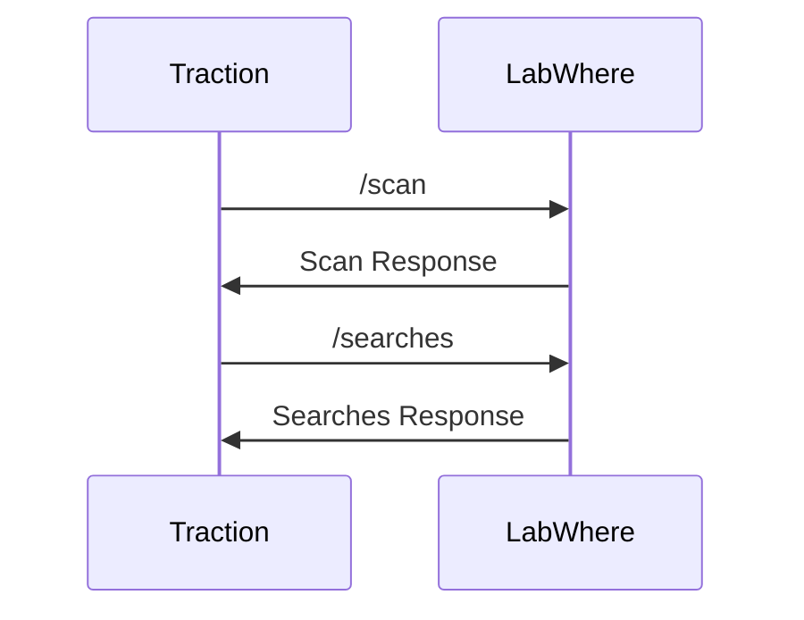

---
# try also 'default' to start simple
theme: apple-basic
# random image from a curated Unsplash collection by Anthony
# like them? see https://unsplash.com/collections/94734566/slidev
# background: https://cover.sli.dev
# some information about your slides (markdown enabled)
title: Our Journey in Rust
titleTemplate: '%s'
favicon: study.png
aspectRatio: 16/9
lineNumbers: true
info: |
  Our Journey in Rust.
# apply UnoCSS classes to the current slide
# class: text-center
# https://sli.dev/features/drawing
drawings:
  persist: false
# slide transition: https://sli.dev/guide/animations.html#slide-transitions
transition: slide-left
# enable MDC Syntax: https://sli.dev/features/mdc
mdc: true
# duration of the presentation
duration: 30min
layout: intro
---


# Our Journey in Rust

The Challenges, Triumphs, and Takeaways

<div class="absolute bottom-10">
  <span class="font-700">
    Dasun 👾 <span v-mark.circle.blue="1">{<code style="color: grey">dp27</code>}</span>, Abdullah <span v-mark.circle.blue="1">{<code style="color: grey">ay6</code>}</span> and Shiv <span v-mark.circle.blue="1">{<code style="color: grey">sb78</code>}</span>
  </span>
</div>

<!-- 

Hello, good afternoon everyone! I am Dasun, and I've got Abdullah and Shiv presenting alongside with me. We are from PSD - which stands for Production Software Development. At PSD, we primarily work on our custom short- and long-read LIMS systems, and our tech stack is quite polyglot by nature so it's quite natural for us to gravitate towards checking out what other programming languages are all about. 

This presentation is about our journey in learning a programming language which was new for us. We want to share our triumphs, the challenges we faced, and leave you with some key takeaways. 

And we will kindly have to ask to hold off to your questions until the end. If the time does not permit it, we will hang around in the networking session after the presentations so please feel free to come and talk to us;

➡️ ➡️ ➡️ 

or for people in Zoom you can always contact us via Slack or Email (our user IDs are there in the slide along with our names).

 -->


---
transition: fade-out
layout: two-cols-header
---

 # The start of a wonderful journey..  

::left::

<div class="mt-6">

 ## Rust Group Project

</div>

- Steve & Dasun collaborated for a couple of weeks.
- Abdullah and Shiv joined later in the journey.

<v-click>

## Prototype Project ("LabWhere")

- Started something closer to our domain.
- Built as a learning <span v-mark.highlight.orange="2"> prototype (not production) </span>.
- Avoided ready-made frameworks.

</v-click>

<v-click at="+2">

## Ways of working

- One session (1 - 1.5hours) a week.
- Took turns in running the session.

</v-click>


::right::

<div class="flex items-center justify-center h-full">
  
</div>


<style>
h1 {
  background-color: #2B90B6;
  background-image: linear-gradient(45deg, #4EC5D4 10%, #146b8c 20%);
  background-size: 100%;
  -webkit-background-clip: text;
  -moz-background-clip: text;
  -webkit-text-fill-color: transparent;
  -moz-text-fill-color: transparent;
}
</style>

<!--

So, Rust was this shiny programming language that made everyone look at their code and say, “Hey, you know what this needs? A complete rewrite… but in Rust.” Naturally, we wanted to join the cult. We knew none of our PSD applications actually needed a rewrite — they were doing just fine. But we figured learning Rust would be a great "excuse" to explore how programming could be made “safer,” especially when it comes to those "sneaky memory leaks" that you read on blog posts every couple of weeks.

We've got Steve in our audience - he's my line manager. So we both decided to learn what Rust is all about and potentially investigate any use cases for it within the institute. We decided that the best way to learn a new language was to actually write something with it. We had some involvement on an on-going project, but then decided to start developing a **prototype** which was much closer to what we do in PSD. And then we found kindred spirits in Abdullah and Shiv — both equally excited to dive into Rust with a hands-on, collaborative approach.

➡️ ➡️ ➡️ 

As I mentioned earlier, the prototype aligns closely with our domain. It’s essentially a reimagining — or rather, an “oxidation” — of an existing application called LabWhere, which provides an interface for scanning and tracking the locations of plates and tubes.

For the prototype, we focused on two specific use cases:

1. Scan-in a plate or a tube into a pre-defined location.
2. Search the plate or tube and assert that the they were scanned into the correct location.

The prototype is a backend component that we’ve integrated with our long-read LIMS frontend, Traction, to showcase its functionality. The connection to the long-read LIMS is controlled via a feature flag — flipping the flag redirects traffic between the original LabWhere service and the prototype.

We intentionally kept the prototype as simple and minimal as possible, using **few abstractions**. Our goal was to understand the syntax and semantics of Rust itself — not to dive into full-fledged web frameworks like Axum or Rocket.

➡️ ➡️ ➡️ 

We need to emphasise the fact that this is in fact a prototype. This was not meant for production.

➡️ ➡️ ➡️ 

One of the key takeaways we want to highlight in this presentation is that we successfully learned a new programming language — its syntax and semantics — and used it to write a small part of an existing system, fully integrated with our current infrastructure. We achieved this through collaborative sessions of just about one to one and a half hours per week — and it’s been a process we’ve genuinely enjoyed.

So, to the next section of our presentation: Shiv will now demonstrate the working of the rust prototype we’ve built.

Over to you, Shiv.

-->

---
transition: slide-up
level: 2
---

# Demonstration

<div class="border-l-4 border-blue-400/80 bg-blue-900/20 p-4  rounded-lg">
  💡<strong class="text-blue-800">Note:</strong></img> is an <b>application</b>. <code>Labware</code> 🧪 🧫 stands for a <b>container</b> (e.g., plates, tubes, etc.)</div>

Denoted here is how Traction  interacts with LabWhere.

<br>

<div class="flex items-center justify-center">



</div>

---
transition: slide-left
level: 2
---

# Implementation Details 

Some tools we've used.

- **Tokio** 
  - Rust’s asynchronous runtime that needs to be plugged in.
  - Required to use `async` and `await` grammar.

- **Hyper** 
  - Abstracts some parts of network programming.
  - Easy access to HTTP request-response cycle.

- **SQLx** 
  - As the SQLite Driver.

---
transition: slide-right
layout: two-cols
layoutClass: gap-16
class: text-xl
---

# Overall architecture

Controller, models and services.

<br>


- A **controller** forwards incoming requests to the corresponding service.
- A **service** contains business logic.
- A **data model** is the interface between the database.

::right::


<div class="flex items-center justify-center h-full dark:invert">
  </img>
</div>


<style>
ul li {
  margin-bottom: 1.5rem;
}
</style>

---
transition: slide-up
level: 2
---

# Controllers


We check the HTTP method (courtesy of Hyper), and the URI to forward request to the service.
````md magic-move {lines: true}
```rs {*|9}{lines:true}
pub async fn process(
    req: Request<impl Body<Data = Bytes, Error = hyper::Error> + Send + Sync + 'static>,
    connection: &Pool<Sqlite>,
) -> Result<Response<BoxBody<Bytes, hyper::Error>>, hyper::Error> {
  if Self::is_post_or_put_request(&req) && !Self::is_valid_content_type(&req) {
      return Self::bad_request_response();
  }
  // This code fragment is a bit akin to the concept of "routes" in web frameworks.
  Self::route(req, connection).await
}
```
</div>

```rs {*|7-9|10-12|13-18|*}{lines:true}
async fn route(
     req: Request<impl Body<Data = Bytes, Error = hyper::Error> + Send + Sync + 'static>,
     connection: &Pool<Sqlite>,
 ) -> Result<Response<BoxBody<Bytes, hyper::Error>>, hyper::Error> {
     match (req.method(), req.uri().path()) {
         (&Method::OPTIONS, _) => Ok(preflight().await),
         (&Method::POST, "/scan") => {
             Ok(scan(connection, &get_request_string(req).await?).await?)
         }
         (&Method::POST, "/searches") => {
             Ok(search(connection, get_request_string(req).await?).await?)
         }
         _ => {
             let mut not_found = Response::new(empty());
             *not_found.status_mut() = StatusCode::NOT_FOUND;
             error!("Responding with not found");
             Ok(not_found)
         }
     }
 }
```
````

---
transition: slide-down
---

# Services

```rust {*|1-4|6-10|*}{lines:true}
pub(crate) async fn search(
    connection: &Pool<Sqlite>,
    request_string: String,
) -> Result<Response<BoxBody<Bytes, hyper::Error>>, hyper::Error> { ... }

#[cfg(test)]
mod tests {
    #[tokio::test]
    async fn test_search() {...}
}
```

```rust {*|1-4|6-12|*}{lines:true}
pub async fn scan(
    connection: &Pool<Sqlite>,
    request: &str,
) -> std::result::Result<Response<BoxBody<Bytes, hyper::Error>>, hyper::Error> { ... }

#[cfg(test)]
mod tests {
    #[tokio::test]
    async fn test_scan() { ... }

    #[tokio::test]
    async fn test_scan_without_correct_content_type() { ... }
}
```

---
transition: fade-out
---

# Models

<div class="grid md:grid-cols-2 gap-4 dark:invert">
    <div>
        
    </div>
    <div>
        
    </div>
</div>

---
transition: slide-left
---

# Code


Let's dive into the code. 

Pardon the dog gifs 🐶

<div class="flex items-center justify-center">
  <div class="grid grid-cols-2 md:grid-cols-3 gap-4">
      <div>
          
      </div>
      <div>
          
      </div>
      <div>
          
      </div>
  </div>
</div>

<!-- 

So now, I’ll walk you through some of the code running behind the demonstration that Shiv just showed. The goal here is simply to give you a sense of how things are structured under the hood. The full codebase is available on GitHub for you to explore at your own pace. We will share the GitHub links for you to go through after the presentation.

-->

---
transition: slide-right
class: text-2xl
---


# Oxidation Compiler 


- Extended our Rust learning
- Contributing to the Oxc project
- Rule architecture and pattern matching in Rust
- Applying our rust concepts to larger projects
- Rust in the real world
- Plan to keep contributing 


---
transition: slide-up
class: text-md
---

# Summary on Rust.

<table>
  <thead>
    <tr>
      <th></th>
      <th v-click="1"><strong>Things we liked 😊</strong></th>
      <th v-click="2"><strong>Things we liked, but found difficult to grasp 🤔</strong></th>
      <th v-click="3"><strong>Things we didn't/don't like 😞</strong></th>
    </tr>
  </thead>
  <tbody>
    <tr>
      <td>1</td>
      <td v-click="1">Pattern matching <code>match</code> statements).</td>
      <td v-click="2">Borrow checker.</td>
      <td v-click="3">Verbosity at times <code>unwrap()</code> call, <code>Result</code>, and <code>Option</code> <em>can</em> be a bit verbose).</td>
    </tr>
    <tr>
      <td>2</td>
      <td v-click="1">Functional-style enums <code>Option</code> and <code>Result</code>).</td>
      <td v-click="2">Lifetimes.</td>
      <td v-click="3">Slow builds.</td>
    </tr>
    <tr>
      <td>3</td>
      <td v-click="1"><code>Cargo</code> as a package manager.</td>
      <td v-click="2">Boxed values (heap-allocated objects) i.e., <code>Box</code>, <code>Arc</code>, etc.</td>
      <td v-click="3"><code>"the method . . . exists but the following trait bounds were not satisfied"</code></td>
    </tr>
    <tr>
      <td>4</td>
      <td v-click="1">Support for tests with <code>#cfg[(test)]</code></td>
      <td v-click="2"></td>
      <td v-click="3"></td>
    </tr>
  </tbody>
</table>

---
transition: fade-out
class: text-xl
---

# Useful Links

- [Rust](https://rust-lang.org/)
- [OXC](https://oxc.rs/)
- [Tokio](https://tokio.rs/)
- [Hyper](https://hyper.rs/)
- [SQLx](https://github.com/launchbadge/sqlx)

Link to our code: [Rust-Wellcome/labwhere](https://github.com/Rust-Wellcome/labwhere)

Link to our slides: [rust-wellcome.github.io/labwhere](https://rust-wellcome.github.io/labwhere)


---
transition: fade-out
layout: intro
---

# Thank You!

You've head about Rust, and now you have seen it too!
✅ ✅

<v-click>

## Key Takeaways

<br>

- **Collaborative learning** played a key role in helping us reach this milestone.
- **Consistent, small weekly efforts** added up and brought us to this point.
- **Keeping abstractions to a minimum** helped us better appreciate Rust’s core philosophy.
- **Learning together kept our motivation high**, and we’ve since started contributing to open-source projects to keep that momentum going.

</v-click>

<!-- 

So, we've come to the end of the presentation. Although, there are some takeaways that we wanted to highlight through this presentation.

- The first one is about **collaborative learning**; it was the key that helped us reach this milestone together.
-	The second one is about the **effort**; by putting in small but consistent weekly efforts, we were able to make steady progress.
-	Third is about **abstractions**; beeping our approach simple and light on abstractions helped us better understand and appreciate Rust’s core philosophy.
-	And finally, through it all, **learning together** kept our motivation high, eventually inspiring us to contribute to open-source projects and keep the momentum going.

We sincerely hope you’ve taken something away from this presentation — not just about Rust, but about the value of learning together as a group. That’s really been our main goal and the biggest takeaway from this journey.

Thank you very much, and thank you for listening to the presentation.

-->
